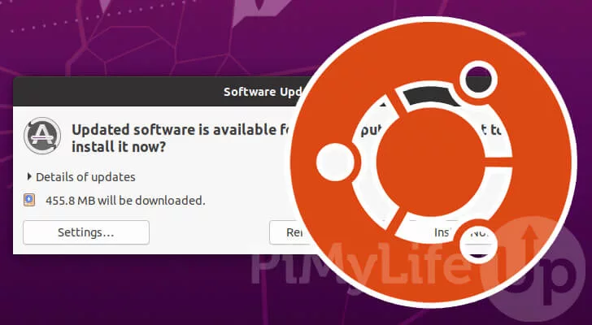
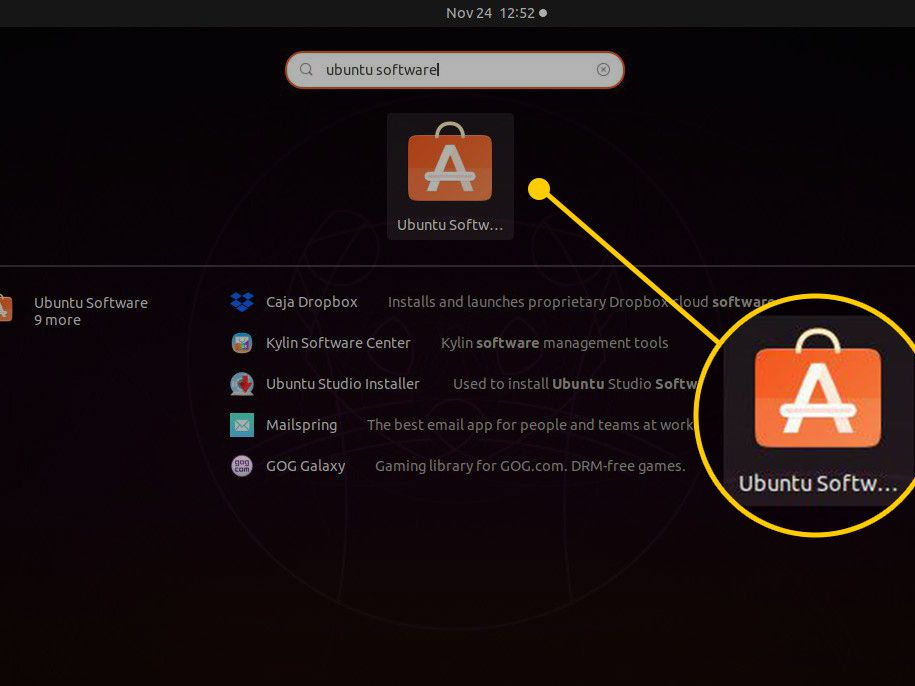
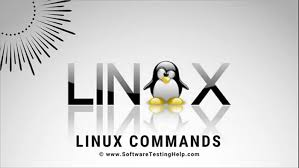
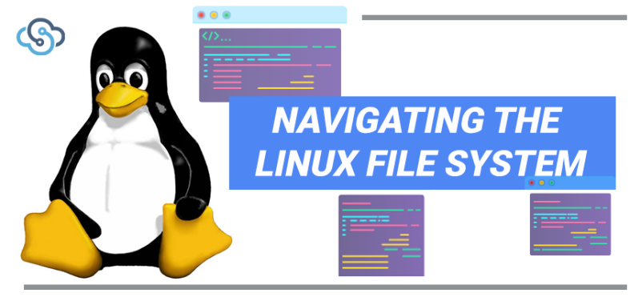
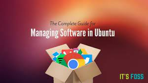

# Deliverable 2 

## What is Virtualization? 

 

**Virtualization:** This is the creation of a computer environment that is not the actual hardware(virtually).This technology lets us create computing services using resources that are traditionally bound to hardware. It is the process of running a virtual instance of a computer system in a layer separate from the actual hardware. e.g  using a virtual machine to run multiple operating systems on the same desktop

In simple word, 
To construct a virtual (rather than an actual) server, desktop, network, or storage device is called virtualization. IT agility, efficiency, and flexibility can all be improved by virtualization. In addition, virtualization can be utilized to build a remote-accessible virtual desktop. 

* Virtualization can also be utilized to create a secure remote access VPN. To speed up a single server or establish a high-performance server farm, virtualization can be used. 

* To design a disaster recovery system or move a physical server, virtualization can be used. Virtualization is a physical solution that allows many operating systems to operate on one computer.

* This reduces excessive server duplication and consolidation, lowers hardware expenses per server, and makes a more efficient workplace for employees. This configuration requires fewer computers, less cooling, and less space in your data centers.

* Virtualization separates computing resources from the programs that use them. For example, a virtual machine is an emulator that mimics the architecture of a physical computer to run software designed for it. Virtualization can be employed at the hardware, operating system, and application levels.

## Virtualbox 

 

**Virtualbox** is a free open-source application that lets you run Linux, Windows, or Mac OS X inside another. The host operating system runs the virtual computers. With VirtualBox, you may run and install another operating system on top of your current one.

**Explanation how we can use VirtualBox and download it :**

* This is handy for testing applications or operating systems without permanently installing them. There are several reasons why someone could want to use this function, including: You need to run an older Windows or Linux application.
     
* You use Linux yet want to test, study, or use a Windows app. Installing VirtualBox is simple if you follow the official website's instructions. 

* However, you must have enough storage space to accommodate the virtual computer. Your computer's processor must enable hardware virtualization to run VirtualBox. To build a new virtual machine, click "New" on the main window. 

* This will begin a wizard to configure your new machine. You must name and configure your machine's operating system, as well as its storage and memory. After you've configured your machine, you may load it up and use it just like any other operating system.
### Creating a virtual machine
server  uses a program called a hypervisor to manage multiple virtual machines that are running at the same time. Virtual machines have virtual hardware, including CPUs, memory, hard drives, and more. Each piece of virtual hardware is mapped to real hardware on the host computer.
1. Download and install VirtualBox from the official website https://www.virtualbox.org/
2. Once you have VirtualBox running, click the "New" button
3. Next you will have to choose which OS you plan on installing (Ubuntu in our case). In the "Name" box, type the name of the OS (ubuntu) you want to install.The wizard will automatically select default settings based on the OS type and version you selected. The memory size depends on your host machine memory size.You can always change the settings as you go through the wizard. Just keep clicking "Continue" and "Create" until you get through the wizard.
4. After this start the virtual machine by clicking start, our ubuntu virtual machine starts

## Installing Ubuntu on VirtualBox 

1. Download the version of  Ubuntu ISO file that you want from ubuntu.com, Start your virtualbox

2. Select your new virtual machine and click 'Settings' button.

3. Click on 'Storage' category and then 'Empty' under Controller:IDE. Click "CD/DVD" icon on right hand side and select the ubuntu ISO file to mount. it is a good idea to specify a large number of processors in virtual machine (default value is 1). You can change this number by clicking on 'System' category

4. Select the Ubuntu ISO file to mount. (our ubuntu ISO file which we downloaded)

5. Back to Oracle VM VirtualBox Manager, click on the new Ubuntu virtual machine and hit 'Start' button.

6. Your virtual machine will now load Ubuntu. The operating system may require some setup, but it will be the same setup that would be required if you had installed it on a standard computer
   
### Updating ubuntu

 

You should always update your device before installing any new program or if it hasn't been updated in a long. The Ubuntu operating system is continually upgraded and updated by Ubuntu Developers and community members who collaborate to ensure that the installed software runs as smoothly as possible. 

As a result, you must update your software packages on a regular basis to ensure that you have access to all of the newest security fixes as well as new features included in each update

**Explanation how to update Ubuntu:**

1. command:`apt-get update` - First, you use the update option to resynchronize the package index files.
`apt-get upgrade` : Second, you use the upgrade option to install the newest versions of all packages currently installed on the Ubuntu system.

2. via software center:Press the Super key (Windows key) on the keyboard, then search for Ubuntu Software in the GNOME dash. When the icon appears, select it.

**click on the Show Applications icon in the bottom left of the desktop and search for Update Manager.**

The application will check for any Ubuntu updates as it launches ,If it does find any, install these first and run Update Manager again if you need to restart your machine.

Update Manager will open a window to inform you that your computer is up to date. Click on the Settings button to open the main user-interface.Select the tab called Updates, if not already selected. Then set the Notify me of a new Ubuntu version dropdown menu to either For any new version or For long-term support versions, if you want to update to the latest LTS release. You may be asked for your password to make this change
**Click on Close to be taken back to the update pane and OK to close this.**

We now need to open Update Manager one more time,  this time Update Manager will open up and tell you that a new distribution is available. **Click Upgrade**

After asking for your password, you will be presented with the Release Notes for the release you're about to upgrade to

**Select the Upgrade button to start the initialization process**. A few moments later you'll be asked Do you want to start the upgrade? Press Start Upgrade to start the upgrade process

The upgrade will now proceed. The Distribution Upgrade pane will track the upgrade process and allow you to monitor progress.Restart the system to complete the upgrade.

### Installing software in Ubuntu via

 

1. command line :`sudo apt install app_name`

2. software center:**Click the Ubuntu Software icon in the Dock**, or search for Software in the Activities search bar

3. When Ubuntu Software launches, search for an application, or select a category and find an application from the list

4. Select the application that you want to install and click Install.You will be asked to authenticate by entering your password. Once you have done that the installation will begin. 

## Basic Linux command 

 

Most people associate Linux with a difficult operating system that is mainly used by programmers.
But it's not as awful as it appears.

**Basic commands are:**

1. **pwd** 
2. **cd**
3. **ls** 
4. **cat**
5. **cp**
6. **mv**
7. **mkdir**
8. **rmdir**
9. **rm**
10. **touch**
11. **sudo**
12. **man**

### Navigating the filesystem

 

1. **pwd**- this command shows us where we are in the file system.It stands for Print Working Directory and prints the current directory
2. **ls**-this gives a list of the files and subdirectories in the directory that we are in at the moment.
3. **cd**-this is the command for changing directories . cd.. takes us to the previous directory while cd. takes us to the home directory.For other directories,the syntax is cd directorate

### managing files and directories

 

1. to create a new directory:**mkdir** directoryname-makes a directory called directoryname
2. to delete/remove a directory:**rmdir** name- these deletes the name directory
3. moving and renaming files or directories:**mv** source destination
4. creating files:**touch** creates an empty file
5. deleting a file:**rm** filename

