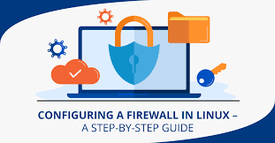

# DELIVERABLE 3 

## Connecting Ubuntu to the Internet

you can do the following to Connect ubuntu to the Internet

**Step 1**: Find out what network interface you have.

**Step 2**: On your Wireless Interface, turn it on.

**Step 3**: Look for wifi access points that are available.

**Step 4**: Create a configuration file for a WPA supplicant.

**Step 5**: Find out what your wireless driver's name is.

**Step 6**: Find a way to get on the internet.

 

If your DNS problem is limited to Ubuntu, use the Network Manager GUI to do the following steps:
 

**Step 1**:Right-click Network Manager and choose Properties.

**Step 2**:Change the Connections.

**Step 3**:Choose the Wi-Fi connection you want to use.

**Step 4**:Select IPv4 Settings from the drop-down menu.

**Step 5**:Change the method to only use DHCP addresses.

**Step 6**:Add 8.8 to the total. 8.8, 8.8, 8.8. 4.4 into the box of the DNS server

**Step 7**:Save and then exit.

## Every day tasks In Ubuntu

 

As ubuntu is free of cost. The everyday task people do on ubuntu are internet browsing, programming, developing, ethical hacking, network monitoring, file editing, etc. 

### Internet browsing

 

Ubuntu is a  operating system based on Debian Linux that is free and open source and is  a secure, fast, stable and open source operating system

Default installation of ubuntu contains wide range of software, example libreoffice, firefox, thunderbird, and lightweight games such as soduku and chess.

ubuntu has many additional software packages which can be accessed from built-in ubuntu software as well as any other apt-based package management tools.

Browsers and emails are also available in ubuntu where we have Firefox, chrome and Microsoft edge.

-Ubuntu can be used in programming i.e. gedit, atom, sublime text, notepad++ and also VSCode are the available code editors.

you can create programs in almost every language 

ubuntu is very fast

it can also be used by web developers in which it supports, git, NodeJS and npm, python, php and have access to databases like mysql, postgresql and mongodbs

-In messaging ubuntu supports skype, viber, slack, telegram, cawbird twitter and can also Discord.

you can also use Ramme to browse Instagram on your PC

- For image editors you can use GIMP which is a free and powerful alternative to Adobe photoshoot that is available in Linux which offers amazing features.

- For video editors  Kdenlive is a best open source video editing software for Linux as it has all basic and also advanced features for video editing.

- Blender is a free and open source 3d computer graphics software toolset that is being used for creating animated films, visual effects, art, 3d printed models, motion graphics, interactive 3d applications, virtual reality and computer games.

-If you want to take a screenshots of Ubuntu and add text, icons and callouts, you can use flameshot. You can use Simple Screen Recorder to capture your screen. 

-Gaming on Linux is often termed as a distant possibility, at least by some hardcore gamers using another platform to play games. Well, you can play games on Ubuntu, but you can not play all the games in Linux.

-Canonical puts security at the heart of Ubuntu. It offers fast fixes, automatic updates, live patching the kernel without rebooting, 5 years of support for LTS versions, protected VMs, secured snap packages and also imposes access control via AppArmor.

-If you want to install Ubuntu on your machine, the version 20 requires a PC with at least a 2 GHz dual core processor, 4 gigabytes of ram and 25 gigabytes of free disk space. For less powerful computers there are other Ubuntu distributions such as Lubuntu and Xubuntu. Ubuntu also supports the ARM architecture.
### Reading email

 

Start by running the Prospect Mail software on your desktop to access your Outlook email account on Linux. After that, when you launch the app, you'll see a login screen. "Sign in to proceed to Outlook," reads the page. Enter your email address and click the blue "Next" button at the bottom.

Using gmail

How to send emails using Gmail from the Ubuntu Terminal
- Launch the Terminal program.
- Make sure the repository index is up to date.
- Set up the Msmtp client.
- Configure msmtp for gmail 
- Install heirloom-mailx in the fifth step.
- Set up Mailx
- Use the Terminal to send an email.
### Remote assistance

- You may also give remote assistance to consumers all around the world. From your Ubuntu workstations, you may access all of your vital data from anywhere, at any time. To protect your privacy, you can opt to blacken your screen when visiting your remote Ubuntu desktops.

 

- Ubuntu has a built-in remote desktop application. You may control your desktop from any computer or mobile device using this method. You'll be able to see what's on the screen, move the mouse, and even type! RDP and VNC are supported via the remote desktop capability, which is included by default in Ubuntu.

### Office productivity (writing documents, editing spreadsheets and doing presentations)

- In Ubuntu, you may use the LibreOffice Writer program to generate documents. LibreOffice writer is pre-installed in Ubuntu 20.04 LTS. To open the program, go to the Dash menu or hit the Windows key, then type LibreOffice writer in the search box.

- Calc is the default program for spreadsheets in Ubuntu. The software launcher also has this option. The spreadsheet program will open after we click on the icon. We can modify the cells just like we would in a Microsoft Excel spreadsheet.

- LibreOffice, a free office suite that substitutes Microsoft Office, is included with Ubuntu. LibreOffice Impress is the LibreOffice version of Microsoft PowerPoint. You should be able to double-click your PPT or PPTX files to open them.D

### Streaming music and video

- Play MP3 files using Rhythmbox, Ubuntu's default music player for MP3 and other audio formats like as WAV, OGG, FLAC, and others. Press the Windows key or click the dash icon in the bottom left corner of the desktop to enter the dash menu and run the Rhythmbox program.

 

- For native Linux game developers, Ubuntu is frequently the platform of choice. It is, nevertheless, the most often used package for ProtonDB testing. We're convinced that playing on Ubuntu will allow you to get the most out of your Steam library.

### Video games

You  activate Steam Play  by going to Steam -> Settings -> Steam Play and checking Enable Steam Play for supported titles and Enable Steam Play for all other titles. By doing this you'll see that games previously unsupported on Linux become playable.

### Video Chatting/calling/conferencing

In Ubuntu, here's how to use Facebook video calling.
Go to Facebook.com, log in with your usual credentials, and choose a friend from your Chat List who is both available to chat and has a device that can receive video calls from your Chat List. In a different window, the video conference will begin.

### Texting/Instant messaging

Because of the abundance of instant messengers, people are no longer limited to sending plain emails. They can also send live images which are known as gifs and other decorated texts. There are a countless number of instant messengers available on the Internet and each messaging application has its own set of features, pricing plan, and licenses which are; 

  * Skype-Skype Web or the application can be installed and used on any computer (Linux, Mac, Windows). A Skype-based video phone is also available for disabled people. This notion is exemplified by Konnekt.
    
  * Signal-Because of the security and end-to-end data encryption provided by Signal, it has become a popular alternative to other messaging applications.  Whereas, Skype, WhatsApp, iMessage, Facebook Messenger, and SMS are all viable options. Voice calls, video calls, one-to-one messages, communities, file sharing, images, stickers, and other features are available in this messaging app. A group chat can have up to 1000 participants, and video calls can have up to 8 participants.
   
  * Slack- is a central platform for exchanging files, tools, and messaging with coworkers. It is a framework that includes tons of add-ins to support a variety of office tools. It has two types of chatting methods: direct message, which is a chat between two people, and Channels, which are group chats. 
  * Discord- is a platform that combines the accessible chat user interface present in many applications such as Slack enabled with voice and video chat. it  is appreciable for chatting with friends while playing games, but it can also be utilized for creating areas where people can gather, socialize, and meet up to find other players.
    
  * Viber- is a free video calling app and instant messaging application that lets its users send images, messages, audio, and video files, make free calls, and also permits you to share your location with other Viber users
  * wire- its  a  modern desktop messaging platform that is ideal for business use is Wire. In this application, End-to-end encryption protects everything.

### Programing 

If you're in charge of a development team, Ubuntu is the greatest method to boost productivity and ensure a smooth transition from development to production. From the data center to the cloud to the Internet of Things, Ubuntu is the world's most popular open source operating system for both development and deployment.

### Educational Applications (dictionaries and that kind of stuff)

It has a steep learning curve, so those who understand how to use it successfully may make a good impression while still being knowledgeable. It acquaints you with operating systems and enables you to operate them with ease using commands.  This article explains how to set up a local DICT server and utilize Ubuntu's built-in Dictionary applications to access a locally stored dictionary. A DICT server is set up with this command. You may now install any dictionary you desire. In the repositories, you'll find dictionaries.

### How to get help with your Ubuntu machine

-  This command is used to display a list of all available commands that come pre-installed in Ubuntu. Press Ctrl+ Alt+ T to open the terminal, or just click the terminal icon in the task bar. Simply type help and press the enter key on the terminal.

 

Basic troubleshooting commands in Ubuntu with examples on how to use them
- To find out what kernel is being used, type uname.
- To view the contents of the boot log, use the command dmesg.
- The program lspci displays a list of all devices discovered on the PCI bus.

## Sources

-   https://help.ubuntu.com/stable/ubuntu-help/net-wireless-connect.html.en

-   https://askubuntu.com/questions/466685/can-ubuntu-open-and-run-microsoft-word-files#:~:text=Yes%20it%20can%2C%20Ubuntu%20comes,doc%20and%20also%20.

-   https://www.dell.com/support/kbdoc/en-ph/000123974/introduction-to-basic-troubleshooting-commands-within-ubuntu-linux

# File Server

## Different file server application

One of the most common ways to network Ubuntu and Windows computers is to configure Samba as a File Server. This section covers setting up a Samba server to share files with Windows clients. The server will be configured to share files with any client on the network without prompting for a password.

The first step is to install the samba package. On configuration, main Samba configuration file is located in /etc/samba/smb.conf. The default configuration file has a significant number of comments in order to document various configuration directives.

### Samba

Samba  is a software package that gives network administrators flexibility and freedom in terms of setup, configuration, and choice of systems and equipment. it is the standard Windows interoperability suite of programs for Linux and Unix.

### Set static ip address 

Steps to set static ip address.

**Step 1**:Open GNOME setting window on ubuntu machine.

**Step 2**:Click on network tab.

**Step 3**:Select IPv4.

**Step 4**:In IPv4 method tab enable Manual option which let user set static ip address.

**Step 5**:In Address tab enter the ip address.

**Step 6**:Click apply to set the static ip address.

### Configuring the firewall

Securing a network with an uncomplicated firewall (UFW)  in ubuntu  is super easy and highly recommended.

**Step 1** - Set Up default UFW policies.

The default policy firewall works out great for both the servers and desktop. It is always a good policy to closes all ports on the server and open only required ports one by one.

Enabling IPv6 support

Make sure the directive IPV6=yes do exists in /etc/default/ufw file.

**Step 2** - Open SSH TCP port 22 connections

The next logical step is to allow incoming SSH ports. We can easily open SSH TCP port 22 using UFW.

**Step 3** - Turn on firewall

Now we got basic configuration enabled. In other words, the firewall will drop all incoming traffic except for ssh TCP port 22. Let us true it on the UFW. Remember, once UFW enabled, it runs across system reboots too.

**Step 4** - Open specific incoming connections/ports

Let us add more rules. Say you want to open ports and allow IP address with ufw.

Allow port ranges via ufw

We can allow port ranges too say, tcp and udp 3000 to 4000:

**Step 5** - Block and deny incoming connections/ports

Do you want to close ports and block certain IP addresses? The syntax is as follows to deny access. In other words, simply ignoring access to port 25:
sudo ufw deny 25/tcp

**Step 6** - Verify status of UFW

**Use the status command**

### How to install the server application you chose

Download the Ubuntu Server installation file into a USB stick (or DVD).

Boot up the machine from USB or DVD (e.g., Hit F11 for the Boot menu, and choose UEFI Boot from USB. UEFI (Unified Extensible Firmware Interface) is a replacement for BIOS.

Follow the instructions to install the server:

- Select your language and location.

- In "Network Configuration", choose your network card (eth0 for the first network card). If you have an static IP number, choose "Configure the network manually". Otherwise, use DHCP (which is the default) for dynamic IP.

- Enter your chosen "hostname".

- Enter the "username" and "password" for the system administrator. Select "no" to encrypt the home directory. By default, Ubuntu creates but locks up the root user for security. Do not user root here.

- Set your time zone.

- For hard disk partition, select "Use entire disk and setup LVM (Logical Volume Manager)". Select the entire disk space for LVM. The installer will create the \boot, \swap and the \ (root) partitions on "sda" (the first disk). You can check the partitions via "lsblk" (list block devices) command or Webmin later.

- Leave blank for HTTP proxy information.

- Select "No Automatic Update". We will run manual update later.

- For packages, select Ubuntu Server, OPEN SSH, LAMP (Linux-Apache-MySQL-PHP), SAMBA (File and Print services for Windows clients), Mail (Local) Server, Postfix (Local) Mail Server, and PostgreSQL. Select other packages if needed.

- Set the root password for MySQL, if LAMP was selected.

- Select "yes" to GRUB boot loader. GRUB (GRand Unified Bootloader) is a Multiboot boot loader.

- Reboot the machine, and login as the system administrator you created earlier.

### Basic commands about managing the server application

Ubuntu features a comprehensive package management system for installing, upgrading, configuring, and removing software.

Ubuntu's package management system is derived from the same system used by the Debian GNU/Linux distribution. The package files contain all of the necessary files, meta-data, and instructions to implement a particular functionality or software application on your Ubuntu computer.

Debian package files typically have the extension .deb, and usually exist in repositories which are collections of packages found online or on physical media, such as CD-ROM discs. Packages are normally in a pre-compiled binary format; thus installation is quick and requires no compiling of software.

Many packages use dependencies which  are additional packages required by the principal package in order to function properly.

- The apt command is a powerful command-line tool, which works with Ubuntu's Advanced Packaging Tool (APT) performing such functions as installation of new software packages, upgrade of existing software packages, updating of the package list index, and even upgrading the entire Ubuntu system.
    
- Launching Aptitude with no command-line options will give you a menu-driven, text-based front-end to the Advanced Packaging Tool (APT) system. Many of the common package management functions, such as installation, removal, and upgrade, can be performed in Aptitude with single-key commands, which are typically lowercase letters.

Aptitude is best suited for use in a non-graphical terminal environment to ensure proper functioning of the command keys.

- dpkg is a package manager for Debian-based systems. It can install, remove, and build packages, but unlike other package management systems, it cannot automatically download and install packages or their dependencies. Apt and Aptitude are newer, and layer additional features on top of dpkg.

- APT Configuration

Configuration of the Advanced Packaging Tool (APT) system repositories is stored in the /etc/apt/sources.list file and the /etc/apt/sources.list.d directory. An example of this file is referenced here, along with information on adding or removing repository references from the file.

You may edit the file to enable repositories or disable them. For example, to disable the requirement of inserting the Ubuntu CD-ROM whenever package operations occur, simply comment out the appropriate line for the CD-ROM, which appears at the top of the file.

### How to start, terminate, and restart a service in Ubuntu

When an application runs in the background, it's called a service. These are essential to run the system or our software applications. Some of the common services you will find on most of the servers are Apache, MySQL, NGINX, etc. When the system boots up, these services are configured to automatically startup.

Using systemctl to start, stop, and restart Ubuntu services

This is the preferred way to manage Ubuntu services. If you are not sure of the service name, you can run systemctl --all command to list all the services. But, there might be hundreds of services running, so it's better to filter the list using the grep command.

- Stop service using systemctl. # systemctl stop mysql.service. ...
    
- Checking Service Status using systemctl. We can check the service status using the below command. ...
    
- Start service using systemctl. # systemctl start mysql.service. ...
    
- Restart service using systemctl.

### You must be able to access this file server in your regular vm (the one you use in the class) and your windows computer

### Important files and directories

### Server log files 

### Sources  