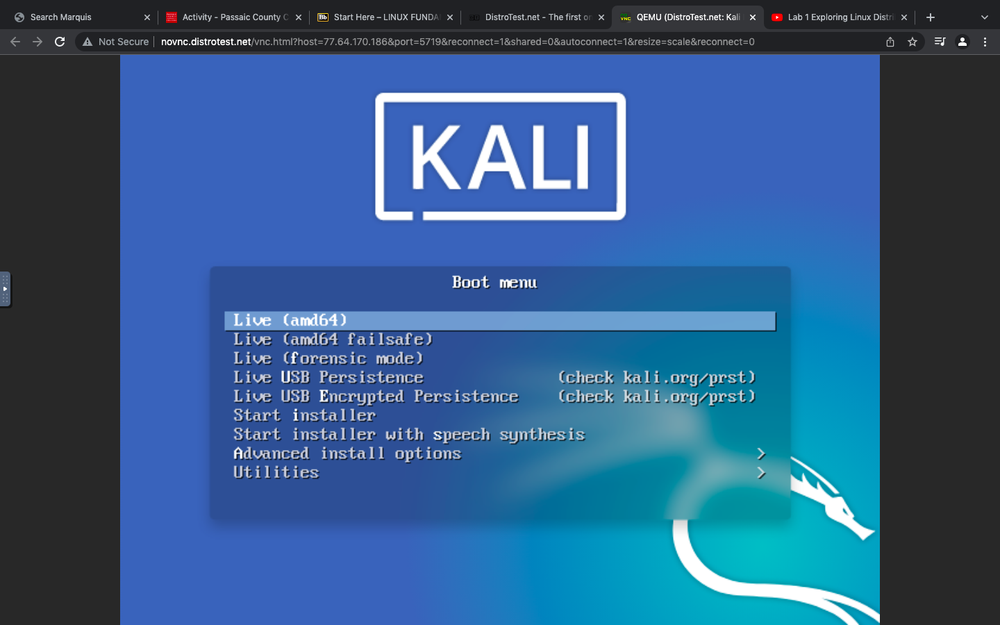
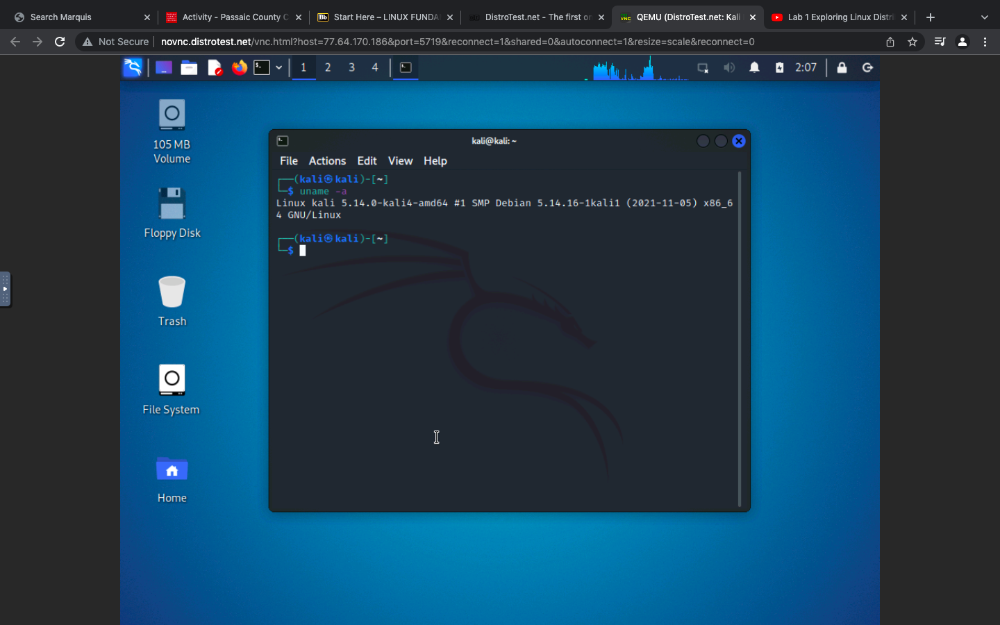
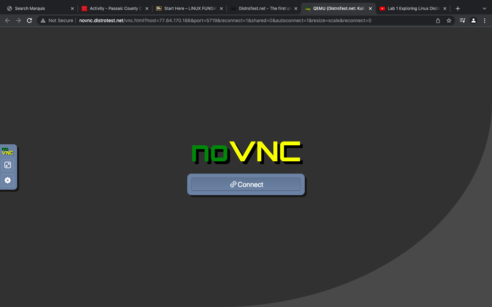

'''
Rimonur Rashid
CIS106
Robert Alberto
'''
# Lab 1 Exploring Linux distributions

## question 1
1. What is the OS Type:
**Linux**
2. Which major distro is it based on?
**Debian**
3. Which processor architecture does it support?
** armhf, ppc64el, riscv, s390x, x86_64**
4. Is the distribution active or is it discontinued?
**Active**
5. What is the distro’s home page?
**https://www.ubuntu.com/**

## question 2
1. What is the name of the distribution and the OS Type:
**Linux**
2. Which major distro is it based on?
**Slackware**
3. Which processor architecture does it support?
**x86_64**
4. Is the distribution active or is it discontinued?
**Active**
5. What is the distro’s home page?
**https://partedmagic.com/**
## question 3
1. What is the name of the distribution?
**Debian**
2. What is the country of Origin?
**Global**
3. What major distribution is it based on?
**Independent**
4. What is the distribution category?
**Desktop, Live Medium, Server**
5. Which processor architecture, aside from the one in the original query, does the OS support?
**aarch64, armel, armhf, i386, i686, mips, mipsel, ppc64el, s390x, x86_64**
## question 4
|Distro|Website|Desktop Environment|
|------|-------|-------------------|
|Kali Linux|http://www.kali.org/| Enlightenment, GNOME, KDE Plasma, LXDE, MATE, Xfce|

|Distro  |Website|Desktop Environment|
|--------|-------|-------------------|
|Karoshi|https://www.linuxschools.com/|Xfce|

|Distro|Website|Desktop Environment|
|------|-------|-------------------|
|Linux Mint|https://linuxmint.com/|Cinnamon, MATE, Xfce|
## question 5

## question 6 

