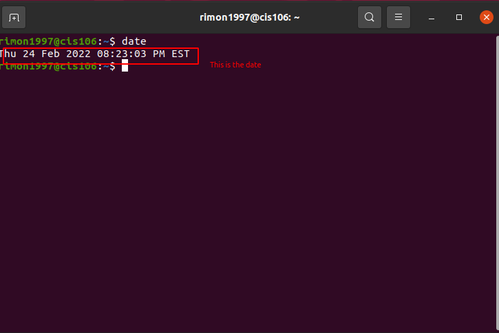
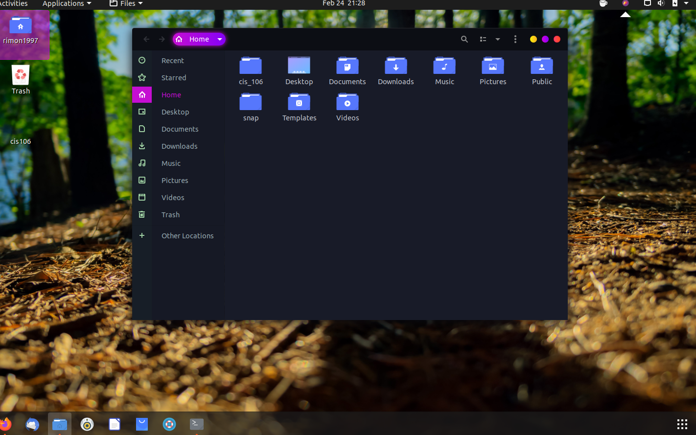

# Lab 3 using Ubuntu 

# Question 1

# Question 2 

# Question 3 

| Program purpose     | Package Name | Version     | Description                   |
| ------------------- | ------------ | ----------- | ----------------------------- |
| Play a tetris game  |Quadrapassel  |1:3.36.0-1   |popular Russian game,tetris    |
| Play a video file   |deepin-movie  |5.0.0-1build1|Deepin movie player, video file|
| Browse the internet |zeal          |1:0.6.1-1build1| browse internet             |
| Read your email     |geary         | 3.36.1-1    |email reader                   |
| Play music          |mopidy-tunein |1.0.0-1      |music player                   |

commands Answers:
* Sub question 1: `sudo apt install 'package+'`
* Sub question 2: `sudo apt purge 'package name' `
* Sub question 3: `sudo apt package name+ package+ package name-`
  
  # Question 4 

| command | what it does                                      |
|---------|---------------------------------------------------|
| echo    |display a line of text                             |
| fortune |print a random, hopefully interesting, adage       |
| cowsay  |configurable speaking/thinking cow (and a bit more)|
| lolcat  |rainbow coloring for text                          |
| figlet  |print its input using large characters             |
| toilet  |display large colourful characters                 |
| rig     |Random Identity Generator                          |