# Lab 4 The linux filesystem 

## Question 1 
### Table 1 
|Directory            |Function                                                       |
|---------------------|---------------------------------------------------------------|
|BIN                  |ESSENTIAL COMMANDS                                             |
|DEV                  |DEVICE FILE                                                    |
|ETC                  |SYSTEM CONFIGURATION                                           |
|HOME                 |USER HOME DIRECTORIES                                          |
|MEDIA                |MOUNT POINT FOR REMOVABLE MEDIA,SUCH AS DVDs AND FLOPPY DISKS  |
|OPT                  |ADD-ON SOFTWARE PACKAGES                                       |
|PROC                 |KERNEL INFORMATION, PROCESS CONTROL,SYSTEM HARDWARE INFORMATION|
|SRV                  |INFORMATION RELATING TO SERVICE THAT RUN ON THE SYSTEM         |
|USR                  |SOFTWARE NOY ESSENTIAL FOR SYSTEM OPERATION,SUCH AS APPLICATION|

### Table 2 
|command|What is does                                    |Syntax        |Example           |
|-------|------------------------------------------------|--------------|------------------|
|CD     |USED FOR CHANGING THE CURRENT WORKING DIRECTORY |`cd+destination`|`cd ~/downloads` |
|PWD    |USED FOR DISPLAYING THE CURRENT WORKING DIRECTORY|`~/option + pwd`|`~/logs$ pwd -l`|
|LS     |USED FOR DISPLAYING ALL FILES INSIDE A GIVEN DIRECTORY|`ls+ option ~/documents`|`ls -x ~/documents`|
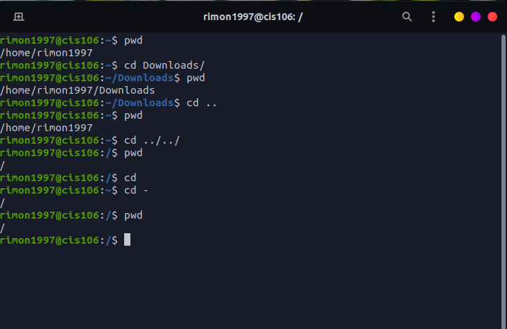  
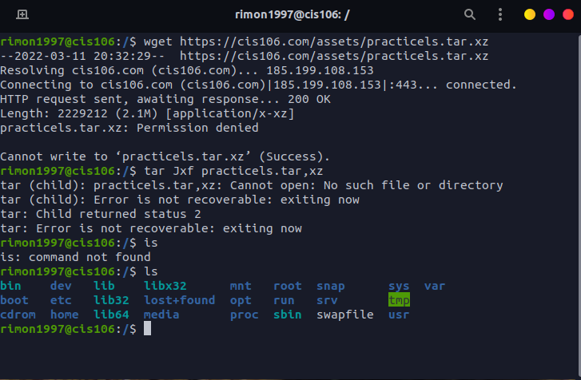 
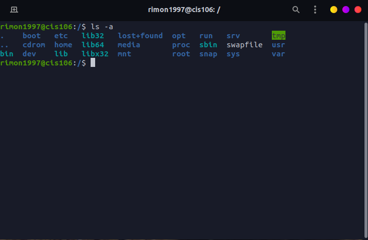  
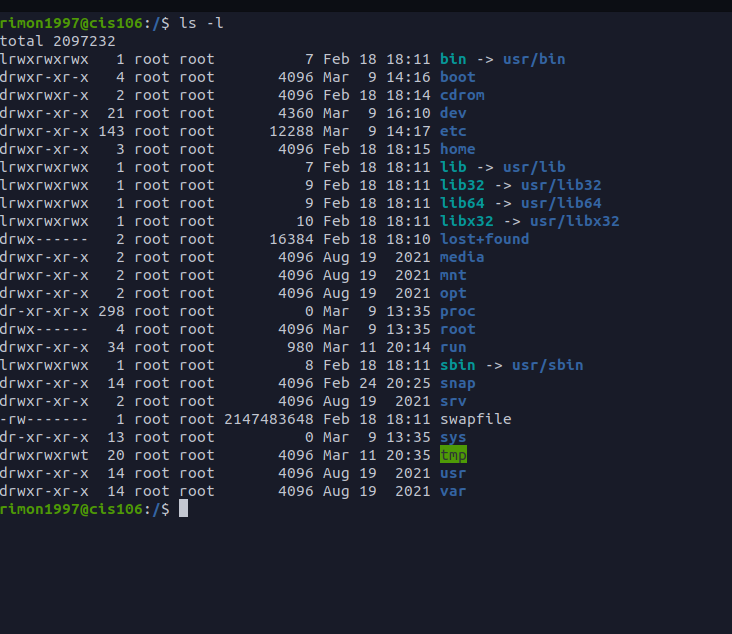  
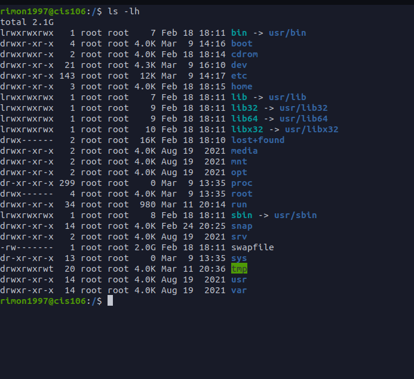  
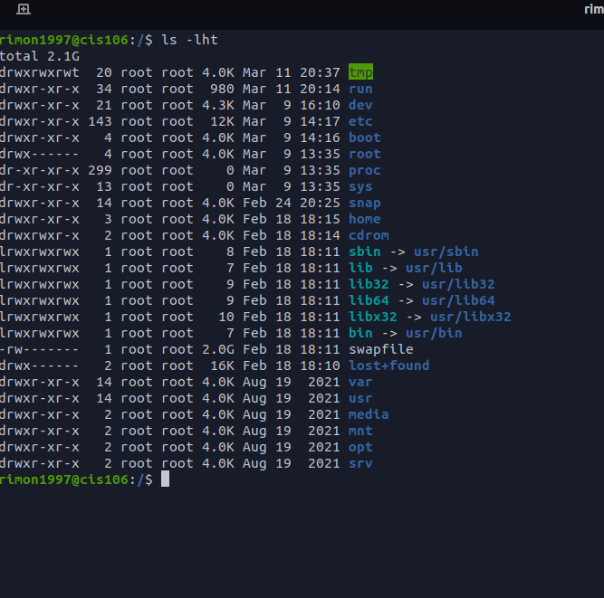 
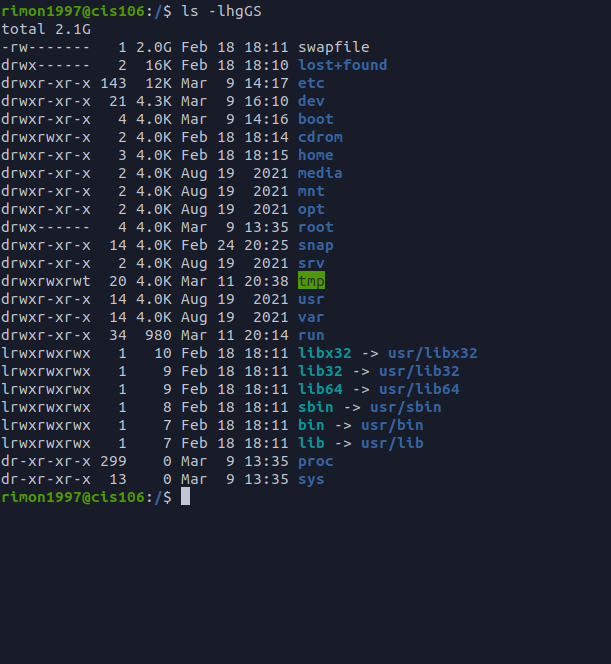 
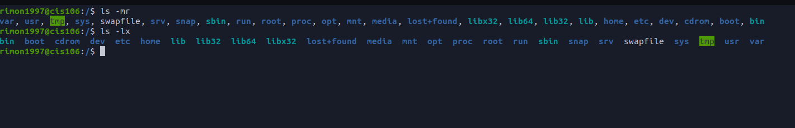 
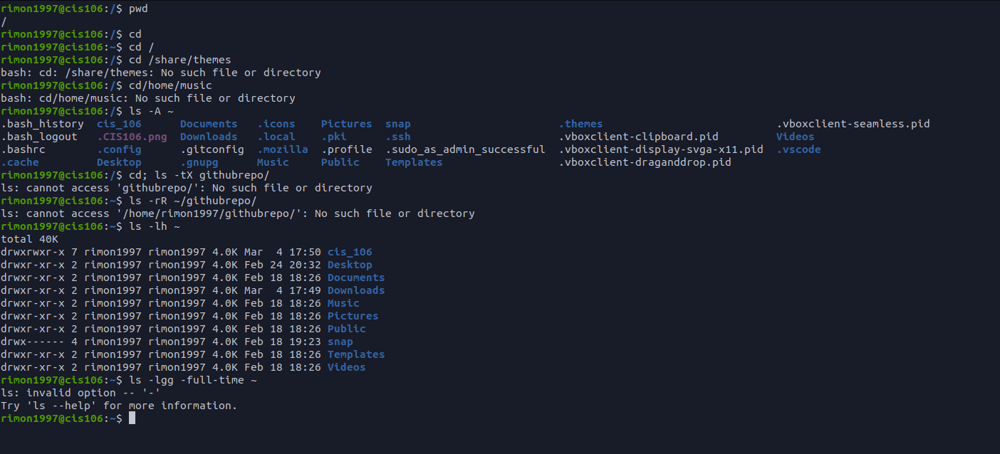 

## Question 2
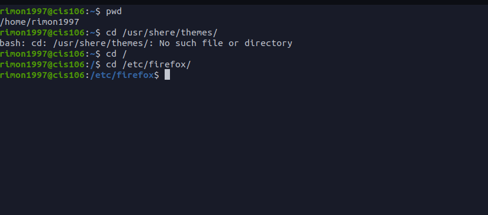 
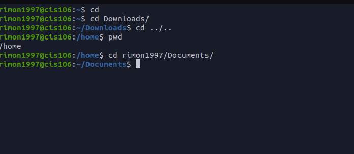 
## Question 3
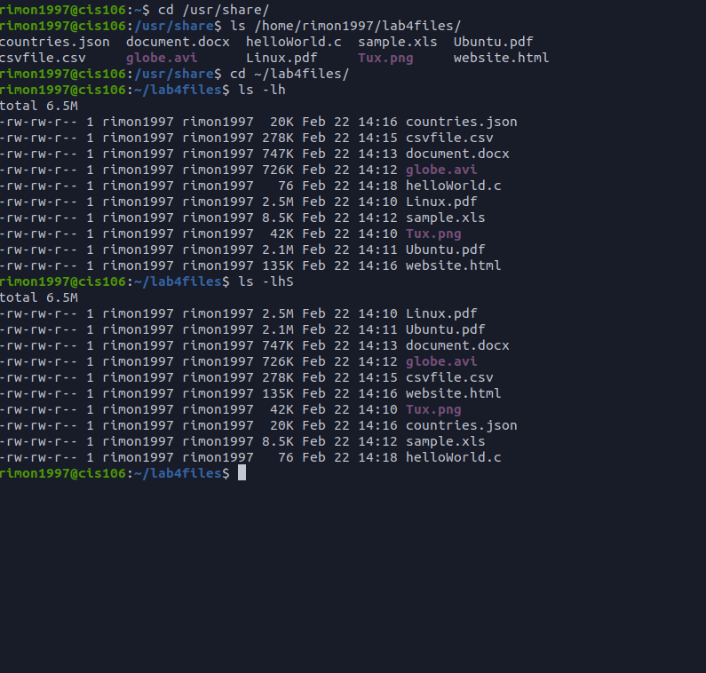 
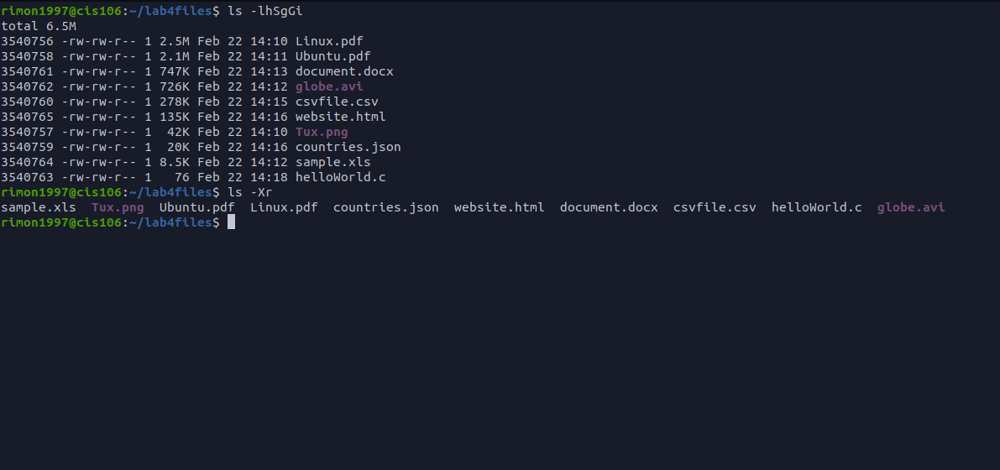 
## Question 4
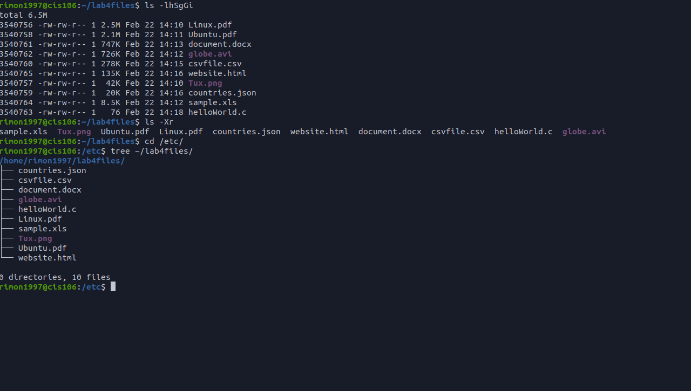 
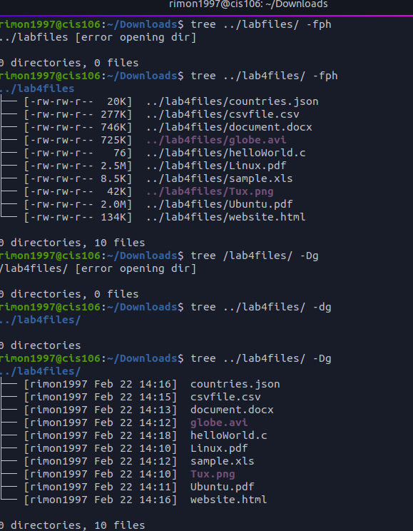 
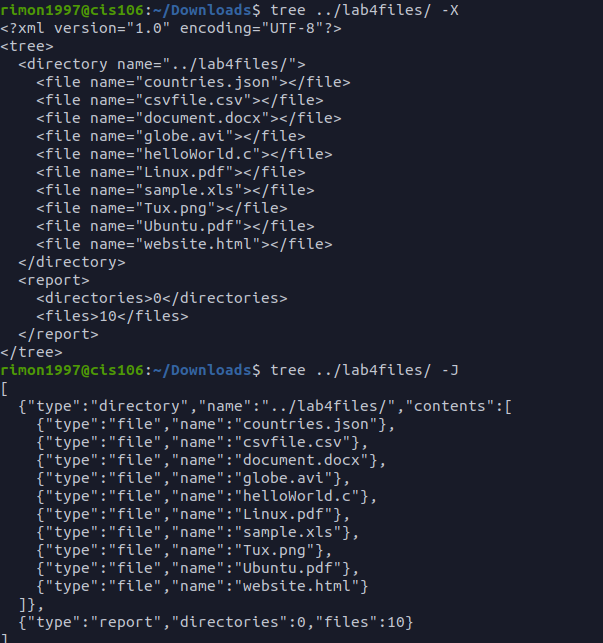 
## Question 5 
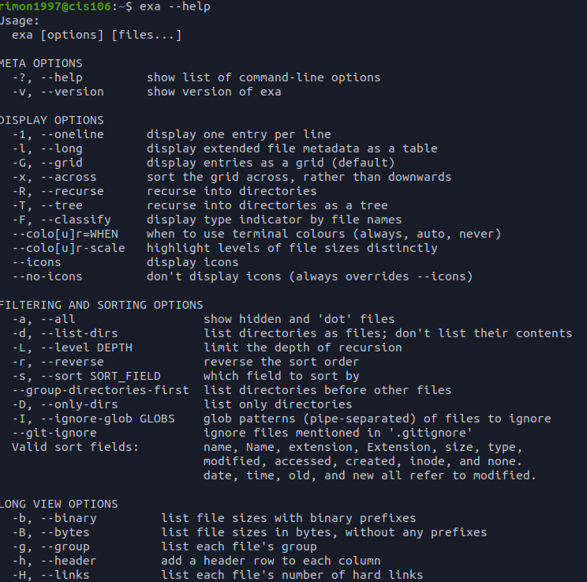 
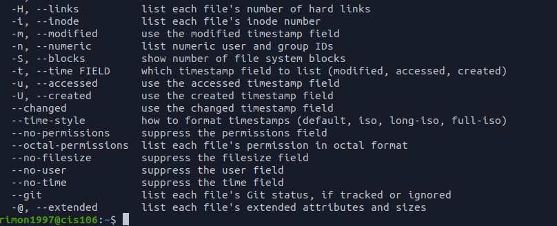 
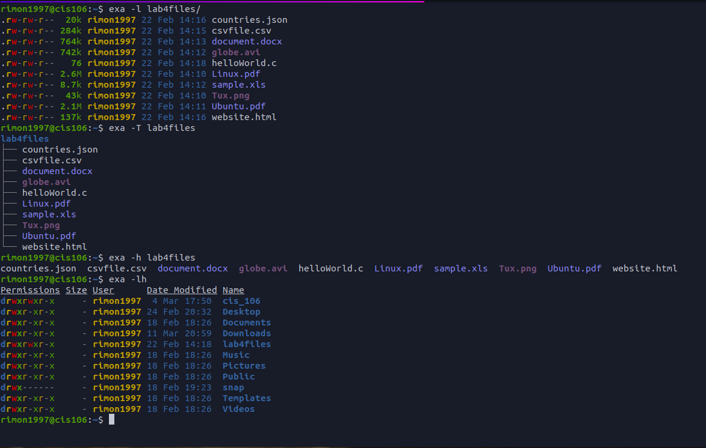 