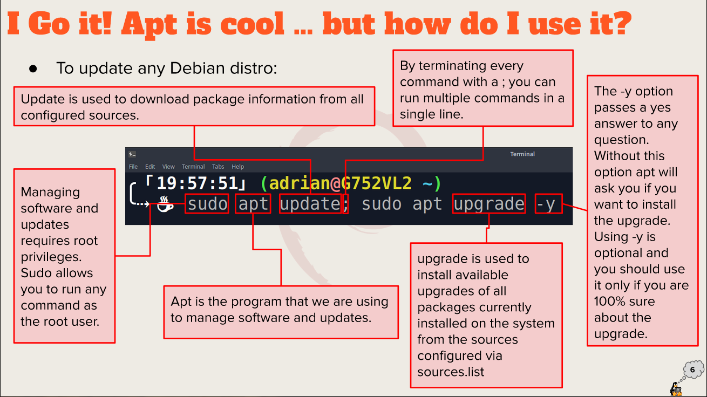

---
Rimonur Rashid
Cis 106
spring 2022
---

# Summary of Presentation 
Ubuntu's default desktop environment has been GNOME Shell since version 17.10.
To provide a solid GNOME desktop experience for our users, the Ubuntu Desktop team collaborated closely with upstream GNOME developers and the larger community. 
1. Exploring desktop environments 
  *  List of  different desktop environments 
      1. **KDE**
      2. **MATE**
      3. **GNOME**
      4. **CINNAMON**
      5. **BUDGIE**
      6. **LXQT**
      7. **XFCE**
      8. **DEEPIN**
  * Definitions for following terms: GUI,DE
      1. GUI Stands for "Graphical User Interface" and is pronounced "gooey." It is a user interface that includes graphical elements, such as windows, icons and buttons.
      2. De is A desktop environment is a collection of programs that run on top of a computer operating system and implements the desktop paradigm. 
  * list of the common elements of a desktop environment
      1. **GNOME**
      2. **KDE**
2. The bash Shell 
  * What is a shell? 
   Shells enable lage-scale computing.
   They're an indispensable tool technology. 
  * List different shells
   1. TCSH SHELL
   2. CSH SHELL
   3. KSH SHELL
   4. ZSH SHELL
   5. FISH SHELL
  * List some bash shortcuts
   1. CTRL+A - go to the start of the command line.
   2. CTRL+E - go to the end of the command line.
   3. CTRL+K - delete from cursor to the end of the command line.
   4. CTRL+U - delete from cursor to the start of command line.
   5. ctrl+w - delete from cursor to the start word.
  * List basic commands and their usage
   1. CTRL+ L - clean the screen
   2. CTRL+ C - terminate the command 
   3. CTRL+ SHIFT+ C - copy the texts 
   4. CYRL+ SHIFT+ V - paste the texts 
3. Managing Software 
  * Command for updating ubuntu
  `sudo apt update; sudo apt upgrade -y`
  * Command for installing software
  `sudo apt install package name -y`
  * Command for removing software
  `sudo apt remove package name -y`
  * Command for searching for software
  `apt search "package name"`
  * Definition of the following terms: 
   1. Package
   Archives that contain binaries of software, configuration file and information about dependencies.
   2. Library 
   reusable code that can be used by more than one function or program.
   3. Repository
   a large collection of software available foe download 

