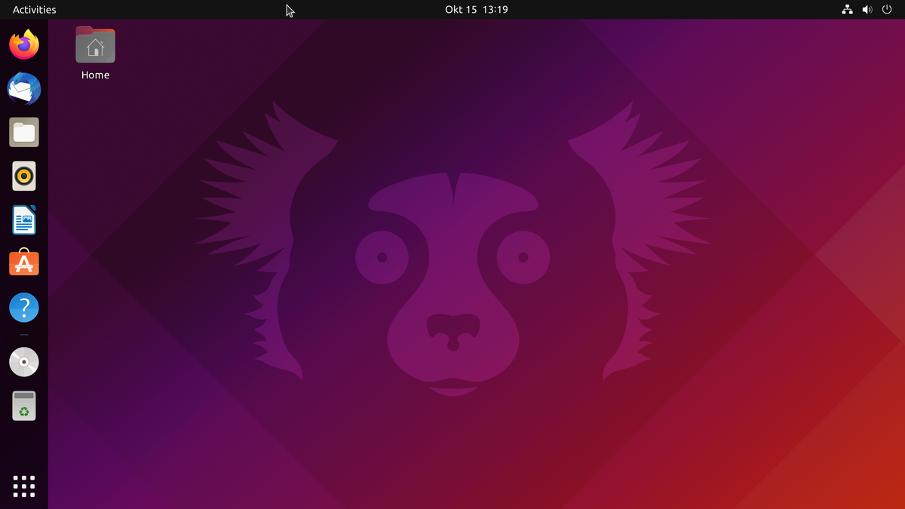

# Ubuntu

Ubuntu is a [Linux distribution](https://en.wikipedia.org/wiki/Linux_distribution) based on Debian and composed mostly of free and open-source software. Ubuntu is officially released in three editions: Desktop, Server, and Core for [Internet of things](https://en.wikipedia.org/wiki/Internet_of_things) devices and robots. All the editions can run on the computer alone, or in a virtual machine. Ubuntu is a popular operating system for cloud computing, with support for OpenStack. Ubuntu's default desktop has been GNOME since version 17.10.

Ubuntu is developed by British company **Canonical,** and a community of other developers, under a meritocratic governance model. Canonical provides security updates and support for each Ubuntu release, starting from the release date and until the release reaches its designated *end-of-life (EOL) date.* Canonical generates revenue through the sale of premium services related to Ubuntu and donations from those who download the Ubuntu software. Ubuntu is named after the **Nguni philosophy** of ubuntu, which Canonical indicates means "humanity to others" with a connotation of "I am what I am because of who we all are".

## Background
> Ubuntu is built on Debian's architecture and infrastructure, and comprises Linux server, desktop and discontinued phone and tablet operating system versions. Ubuntu releases updated versions predictably every six months, and each release receives free support for nine monthThe recommended system requirements are:s (eighteen months prior to 13.04) with security fixes, high- impact bug fixes and conservative, substantially beneficial low-risk bug fixes. The first release was in October 2004.


Current long-term support (LTS) releases are supported for five years, and are released every two years. Since the release of Ubuntu 6.06, every fourth release receives long-term support. Long-term support


includes updates for new hardware, security patches and updates to the 'Ubuntu stack' (cloud computing infrastructure). The first LTS releases were supported for three years on the desktop and five years on the server; since Ubuntu 12.04 LTS, desktop support for LTS releases was increased to five years as well. LTS releases get regular point releases with support for new hardware and integration of all the updates published in that series to date.

## Features
A default installation of Ubuntu contains a wide range of software that includes LibreOffice, Firefox,Thunderbird, Transmission, and several lightweight games such as Sudoku and Mines. Many additional software packages are accessible from the built in Ubuntu Software (previously Ubuntu Software Center) as well as any other APT-based package management tools. Many additional software packages that are no longer installed by default, such as Evolution, GIMP, Pidgin, and Synaptic, are still accessible in the repositories and installable by the main tool or by any other APT-based package management tool. Cross-distribution snap packages and flatpaks are also available,that both allow installing software, such as some of Microsoft's software, in most of the major Linux operating systems (such as any currently supported Ubuntu version and in Fedora). The default file manager is GNOME Files, formerly called Nautilus.

### Security 
Ubuntu aims to be secure by default. User programs run with low privileges and cannot corrupt the operating system or other users' files. For increased security, the sudo tool is used to assign temporary privileges for performing administrative tasks, which allows the root account to remain locked and helps prevent inexperienced users from inadvertently making catastrophic system changes or opening security holes. Polkit is also being widely implemented into the desktop. The recommended system requirements are:ftware into four domains to reflect differences in licensing and the degree of support available. Some unsupported applications receive updates from community members, but not from Canonical Ltd.

## Recommended Minimum System Requirements

### Ubuntu Desktop Edition
1.  2 GHz dual core processor
2.  4 GiB RAM (system memory)
3.  25 GB (8.6 GB for minimal) of hard-drive space (or USB stick, memory card or external drive but see
LiveCD for an alternative approach)
4. VGA capable of 1024x768 screen resolution
5.  Either a CD/DVD drive or a USB port for the installer media
6.  Internet access is helpful


### Ubuntu Server Edition
Ubuntu 20.04 Server Edition provides a common, minimalist base for a variety of server applications, such as file/print services, web hosting, email hosting, etc. This version supports four 64-bit architectures:

   * amd64 (Intel/AMD 64-bit)
   * arm64 (64-bit ARM)
   * ppc64el (POWER8 and POWER9)
   * s390x (IBM Z and LinuxONE)

**The recommended system requirements are:**
   * CPU: 1 gigahertz or better
   * RAM: 1 gigabyte or more
   * Disk: a minimum of 2.5 gigabytes

### Releases
| Version | Code Name     | Release Date|
|---------|---------------|-------------|
|14.04 LTS|Trusty Tahr    |2014-04-17   |
|16.04 LTS|Xenial Xerus   |2016-04-21   |
|18.04 LTS|Bionic Beaver  |2018-04-26   |
|20.04 LTS|Focal Fossa    |2020-04-23   |
|21.04    |Hirsute Hippo  |2021-04-22   |
|21.10    |Impish Indri   |2021-10-14   |
|22.04 LTS|Jammy Jellyfish|2022-04-21   |

### Variants
Ubuntu Desktop (formally named as Ubuntu Desktop Edition, and simply called Ubuntu) is the variant officially recommended for most users. It is designed for desktop and laptop PCs and officially supported by Canonical. A number of variants are distinguished simply by each featuring a different desktop environment. LXQt and Xfce are often recommended for use with older PCs that may have less memory and processing power available.

#### Official distributions
|Distribution logo|Distribution Name| Description|
|------------------|----------------|------------|
||Kubuntu|An Ubuntu flavour using the KDE interface instead of the GNOME|
||Labuntu|An Ubuntu flavour that is "lighter, less resource hungry and more energy-efficient", using the LXQt desktop environment
|
||Ubuntu Core|An Ubuntu edition focussed on IoT and embedded systems.|
||Ubuntu Budgie|An Ubuntu flavour using Budgie.|
||Ubuntu Kylin|An Ubuntu flavour aimed at the Chinese market.|
||Ubuntu MATE|An Ubuntu flavour using MATE, a desktop environment|
||Ubuntu Server|Server edition of Ubuntu Desktop with no Desktop Environment|
||Ubuntu Studio|Based on Ubuntu, providing open-source applications for multimedia creation aimed at the audio, video and graphic editors.|
||Xubuntu|An Ubuntu flavour using Xfce.|

## How to update Ubuntu 
First, open the terminal in Ubuntu desktop. You can find it in the menu, or use the Ctrl+Alt+T keyboard shortcut. If you are logged on to an Ubuntu server, you already have access to a terminal.

In the terminal, you just have to use the following command:
`sudo apt update && sudo apt upgrade -y`
```
sudo apt update
sudo apt upgrade
```
